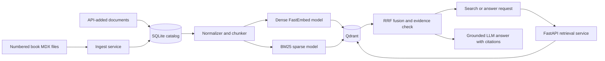

# How Qdrant Works in Susume Nihongo

Qdrant is the search index for this project. It stores vectorized chunks of the Japanese-learning content and returns candidates for search and grounded answers.

Qdrant is deliberately **not** the source of truth. SQLite stores the durable document catalog, normalized content, metadata, content hashes, timestamps, and indexing status. If the Qdrant volume is lost, the index can be rebuilt from SQLite and the numbered book chapters.

## Architecture



The relevant implementation is split across:

- [`backend/app/services.py`](backend/app/services.py): Qdrant collection management, indexing, deletion, retrieval, fusion, and evidence checks.
- [`backend/app/mdx.py`](backend/app/mdx.py): MDX normalization, token-aware chunking, hashes, and deterministic IDs.
- [`backend/app/repository.py`](backend/app/repository.py): the SQLite source-of-truth catalog and indexing status.
- [`backend/app/cli.py`](backend/app/cli.py): the one-shot book ingestion command.
- [`compose.yaml`](compose.yaml): Qdrant networking, authentication, storage, health checks, and service startup order.

## Collection schema

The collection is named `susume_knowledge_v1` by default. It has two named vectors per point:

| Vector | Purpose | Configuration |
| --- | --- | --- |
| `dense` | Semantic similarity across English, Japanese, and romaji | 384 dimensions, cosine distance, `sentence-transformers/paraphrase-multilingual-MiniLM-L12-v2` |
| `bm25` | Exact and lexical term matching | Sparse BM25 vector with Qdrant IDF modifier, generated by `Qdrant/bm25` |

The backend also creates keyword payload indexes for:

- `document_id`
- `source_type`
- `level`
- `tags`
- `content_hash`

On startup or ingestion, `VectorIndex.ensure_collection()` creates the collection when it does not exist. If the collection already exists, the backend verifies the dense dimension and named vectors. It intentionally refuses to reindex into an incompatible schema. A model or dimension change requires a new collection version and an explicit migration.

## What one Qdrant point contains

One Qdrant point represents one content chunk, not one whole document. Its payload contains:

- Document ID and title
- Chunk text and chunk index
- JLPT level and tags
- Source type (`book` or `manual`)
- Source reference, chapter, and section
- Content hash
- Created, updated, and indexed timestamps

Each point ID is a deterministic UUID5 calculated from the document ID, document content hash, and chunk index. Reindexing unchanged content therefore produces the same IDs. When content changes, the backend deletes all existing points for that document before inserting the newly generated chunks.

## Ingestion and indexing

### Initial book ingestion

The Compose `ingest` service runs `susume ingest` after Qdrant becomes healthy. It processes only files matching `book/[0-9][0-9].mdx`; planning documents, images, and `index.astro` are excluded.

For every chapter, the pipeline:

1. Removes imports, image paths, comments, and component markup while preserving useful text and JSX string values.
2. Normalizes title, JLPT level, chapter, tags, headings, examples, translations, grammar content, and quizzes.
3. Calculates a SHA-256 content hash and upserts the normalized document into SQLite.
4. Skips Qdrant work when an already-indexed chapter has the same hash.
5. Splits changed content within heading boundaries.
6. Generates dense and BM25 sparse vectors locally with FastEmbed.
7. Replaces that document's Qdrant points and marks the SQLite row `indexed`.

Removed numbered chapters are deleted from both SQLite and Qdrant. Manual documents are never removed by book synchronization.

The ingest job writes `/data/.book_ingest_complete` after a successful run. The backend readiness endpoint remains unavailable until the marker exists.

### Chunking

Chunks are limited to 320 embedding-model tokens with a 48-token overlap. Heading sections are kept separate. Oversized paragraphs are split at a nearby space, newline, or Japanese full stop when possible.

The text embedded into both vector models is prefixed with context:

```text
Document title
JLPT: N5
Section: Topic Marker

Chunk content...
```

The payload keeps the original chunk text without this embedding prefix so search results and citations show clean source content.

### API-created documents

Creating, uploading, or updating a document first writes it to SQLite with `pending` status. The request then synchronously indexes it in Qdrant and changes the status to `indexed`.

If indexing fails, the document remains in SQLite with `failed` status and a bounded error message. It can be retried with:

```bash
curl -sS -X POST "http://localhost:8080/api/v1/documents/DOCUMENT_ID/reindex" \
  -H "X-API-Key: $ADMIN_API_KEY"
```

Deletion removes the document's Qdrant points before deleting its SQLite record.

## Hybrid retrieval

A search request is embedded twice locally:

1. The dense model produces a 384-dimensional query vector.
2. The BM25 model produces a sparse query vector.

The backend requests up to 24 dense candidates and 24 sparse candidates from Qdrant. Optional `level`, `tags`, and `source_type` filters are applied to both searches in Qdrant.

The backend then performs Reciprocal Rank Fusion (RRF):

```text
fused score += 1 / (60 + result rank)
```

A point returned by both searches receives contributions from both rankings. The fused list is sorted and trimmed to the requested `top_k`, which must be between 1 and 20.

Fusion currently happens in FastAPI rather than in a Qdrant server-side fusion query. Search results expose the fused score plus the original dense and lexical scores for diagnostics.

### Evidence gating

Retrieval candidates are not automatically considered sufficient evidence. Before an answer is sent to the LLM, the backend checks that at least one result has:

- A positive lexical match corroborated by a meaningful query term; or
- A dense score at least `DENSE_RELEVANCE_FLOOR` (default `0.25`) with query-term corroboration; or
- A dense score at least `0.15` above that floor.

This guards against the multilingual embedding model's positive cosine baseline for unrelated short queries. When evidence is insufficient, the API returns the standard “not found in the current book” response without calling the LLM.

For grounded answers, adjacent chunks from the same document are collapsed into at most six source groups. Those groups become the only reference material available to the LLM and are returned as validated citations.

## Docker networking and security

Qdrant runs as `qdrant/qdrant:v1.18.3-unprivileged` with:

- Authentication through `QDRANT__SERVICE__API_KEY`
- All Linux capabilities dropped
- `no-new-privileges`
- Telemetry disabled
- No public `0.0.0.0` binding
- Persistent storage in the `qdrant-data` named volume

The backend and ingest services connect to `http://qdrant:6333` on the internal `private` Docker network. The browser dashboard uses a separate Docker network and is published only to the host loopback interface:

```text
127.0.0.1:6333 -> qdrant:6333
```

This means the dashboard is accessible from the Docker host but not from other machines on the LAN.

Open the dashboard at:

<http://localhost:6333/dashboard/>

The API key is stored in `.env`. To display it in your local terminal for the dashboard connection prompt:

```bash
rtk sed -n 's/^QDRANT_API_KEY=//p' .env
```

Do not commit `.env`, paste the key into browser code, or bind port 6333 to `0.0.0.0` on an internet-facing host.

## Configuration

| Environment variable | Default | Meaning |
| --- | --- | --- |
| `QDRANT_URL` | `http://qdrant:6333` | Internal backend connection URL |
| `QDRANT_API_KEY` | No safe default | Shared credential used by Qdrant, ingest, and backend |
| `QDRANT_DASHBOARD_PORT` | `6333` | Localhost port for the Web UI |
| `QDRANT_COLLECTION` | `susume_knowledge_v1` | Collection version/name |
| `EMBEDDING_MODEL` | Multilingual MiniLM | Dense FastEmbed model |
| `SPARSE_MODEL` | `Qdrant/bm25` | Sparse FastEmbed model |
| `DENSE_DIMENSION` | `384` | Required dense vector dimension |
| `DENSE_RELEVANCE_FLOOR` | `0.25` | Minimum dense evidence threshold |
| `MAX_CHUNK_TOKENS` | `320` | Maximum chunk token count |
| `CHUNK_OVERLAP_TOKENS` | `48` | Overlap between consecutive chunks in a section |

`compose.yaml` currently forwards the Qdrant URL/key and dense relevance floor explicitly. The other names are supported by the Pydantic settings layer; add them to the backend and ingest service environment mappings if they need to be overridden in Docker.

## Operations

### Check readiness

```bash
curl -fsS http://localhost:8080/api/health/ready
rtk docker compose ps
```

The readiness response checks SQLite, Qdrant collection access, and completion of initial ingestion.

### Reindex the book

The public application routes mutations through FastAPI rather than exposing Qdrant directly:

```bash
curl -sS -X POST http://localhost:8080/api/v1/admin/reindex-book \
  -H "X-API-Key: $ADMIN_API_KEY"
```

The operation is idempotent by content hash. Unchanged indexed chapters are skipped.

The one-shot container can also be run directly:

```bash
rtk docker compose run --rm ingest
```

### Inspect logs

```bash
rtk docker compose logs --tail 200 qdrant ingest backend
```

### Inspect the collection API

The dashboard is the easiest inspection tool. For a direct authenticated request without copying the key into command history, run it from the backend container:

```bash
rtk docker compose exec -T backend python -c \
  "import os, urllib.request; request=urllib.request.Request('http://qdrant:6333/collections/susume_knowledge_v1', headers={'api-key': os.environ['QDRANT_API_KEY']}); print(urllib.request.urlopen(request).read().decode())"
```

## Persistence, backup, and recovery

The `qdrant-data` volume stores the Qdrant collection and index files. Retaining it makes restart and recovery fast. The `catalog-data` volume is more important because it contains SQLite and all API-added document content.

Recommended backup priority:

1. Back up `catalog-data`/`documents.sqlite3` as the critical source of truth.
2. Back up `qdrant-data` for faster restoration.
3. Retain the numbered `book/*.mdx` files in version control.

If Qdrant storage is lost, restore SQLite and the book files, create the collection, and explicitly reindex every catalog document. The normal book synchronization skips unchanged rows already marked `indexed`, so it does not by itself detect that a previously indexed Qdrant volume has been replaced. Book and manual document IDs can both be sent to `POST /api/v1/documents/{id}/reindex`. Do not delete either named volume unless a verified backup exists.

## Troubleshooting

### Dashboard does not open

- Confirm Qdrant is healthy with `rtk docker compose ps qdrant`.
- Confirm the port shows `127.0.0.1:6333->6333/tcp`.
- Check whether another application is using the configured `QDRANT_DASHBOARD_PORT`.
- The loopback binding is only accessible on the Docker host. Use an SSH tunnel rather than a public port when managing a remote host.

### Dashboard or API returns `401 Unauthorized`

Qdrant and the backend must use the same `QDRANT_API_KEY`. After changing the key, recreate Qdrant, ingest, and backend so all services receive the new value:

```bash
rtk docker compose up -d --force-recreate qdrant ingest backend
```

### Backend is not ready

Check `ingest` and `qdrant` logs. The backend requires a reachable collection and a successful ingest marker. An ingest failure leaves affected SQLite documents in `failed` status for diagnosis and retry.

### Collection schema mismatch

Do not force an in-place reindex. A different dense dimension or named-vector layout requires a new collection name, such as `susume_knowledge_v2`, followed by an explicit migration and validation before traffic is switched.

### Search returns weak or irrelevant matches

- Inspect both `dense_score` and `lexical_score` from `/api/v1/search`.
- Verify the expected document has `indexed` status in `/api/v1/documents`.
- Confirm the request filters are not excluding the relevant JLPT level, tag, or source type.
- Reindex the affected document if SQLite content is correct but Qdrant is stale.
- Tune `DENSE_RELEVANCE_FLOOR` carefully and rerun the Qdrant integration tests after changing it.

## Verification

The live integration suite checks collection schema, payload indexes, English/Japanese/romaji hybrid retrieval, JLPT filters, irrelevant-query rejection, and persistence against a real Qdrant container. The command is documented in [`README.md`](README.md#development-and-verification).

Unit and integration tests related to Qdrant are located in:

- [`backend/tests/test_qdrant_integration.py`](backend/tests/test_qdrant_integration.py)
- [`backend/tests/test_search_evidence.py`](backend/tests/test_search_evidence.py)
- [`backend/tests/test_models_repository.py`](backend/tests/test_models_repository.py)
