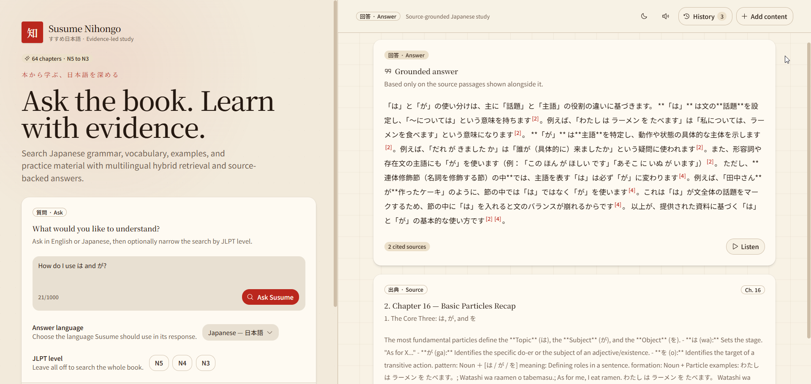

# Susume Nihongo Vector Knowledge App

A single-host, Dockerized Japanese-learning knowledge app with a desktop-first, Japanese-inspired interface. It indexes the 64 numbered chapters in [`book/`](book/) with local multilingual dense embeddings and BM25 sparse vectors, serves hybrid search through FastAPI, and generates citation-validated answers through OpenRouter or another OpenAI-compatible Chat Completions gateway.


SQLite is the durable catalog and source of truth for content added through the API. Qdrant is a rebuildable search index. The original book files are mounted read-only and are never changed by the web app.

For the complete indexing, retrieval, security, dashboard, and recovery design, see [`Qdrant.md`](Qdrant.md).

## Highlights

- Full-screen, two-column study workspace with responsive mobile Ask and Answer views.
- Evidence-backed Markdown answers with headings, lists, examples, grammar notation, inline chapter citations, and source previews.
- Japanese, English, Portuguese, Spanish, and French answer generation with selectable speech models and compatible voices.
- Sentence-level read-along highlighting with per-clip progress, automatic follow scrolling, and reduced-motion support.
- Prepared and cached sentence clips for gap-free sequential playback and generation-free replays.
- Searchable, browser-local Study archive for reopening and managing previous answers.
- Japanese-inspired light and dark themes, including the `知` (knowledge) identity.
- Admin workflows for adding notes, uploading documents, and rebuilding the search index.

## Start the stack

Requirements: Docker Engine with Compose v2 and enough disk for the application images, Qdrant data, and approximately 250 MB of baked embedding assets.

```bash
cp .env.example .env
# Set independent, random ADMIN_API_KEY and QDRANT_API_KEY values in .env.
# Set OPENROUTER_API_KEY. Answer and speech generation share this server-side key.
docker compose up --build -d
docker compose ps
curl -fsS http://localhost:8080/api/health/ready
```

Open <http://localhost:8080>. FastAPI remains private. The authenticated Qdrant dashboard is bound to the host loopback interface at <http://localhost:6333/dashboard>, so it is available from this machine but not published to the LAN.

The first build downloads the configured FastEmbed dense and sparse models into the backend image. Runtime startup does not need model-network access. The one-shot `ingest` service waits for Qdrant, synchronizes exactly `book/[0-9][0-9].mdx`, and must finish before the backend and frontend become ready.

## OpenRouter model selection

The example environment uses [OpenRouter's Chat Completions API](https://openrouter.ai/docs/quickstart). Create an API key, put it only in the server-side `.env`, and choose any model slug from the [OpenRouter model catalog](https://openrouter.ai/models):

```dotenv
LLM_PROVIDER=openrouter
OPENROUTER_API_KEY=sk-or-v1-...
OPENROUTER_MODEL=~anthropic/claude-sonnet-latest
OPENROUTER_TTS_MODEL=x-ai/grok-voice-tts-1.0
OPENROUTER_TTS_JAPANESE_VOICE=ara
OPENROUTER_TTS_ENGLISH_VOICE=ara
OPENROUTER_TTS_PORTUGUESE_VOICE=ara
OPENROUTER_TTS_SPANISH_VOICE=ara
OPENROUTER_TTS_FRENCH_VOICE=ara
```

After changing models, recreate only the backend (no reindex or frontend rebuild is needed):

```bash
docker compose up -d --force-recreate backend
```

`OPENROUTER_TTS_MODEL` configures the default model used by the answer card's Listen action. Users can switch among currently available speech models from the answer card; the browser fetches the safe model catalog through the backend and never receives the OpenRouter key. Japanese, English, Portuguese, Spanish, and French answers use a compatible advertised voice, falling back to the separately configurable server-side voices. The backend requests MP3 from [OpenRouter's Audio Speech API](https://openrouter.ai/docs/guides/overview/multimodal/tts).

Before asking, users can choose Automatic, Japanese, English, Portuguese, Spanish, or French as the answer language. The browser keeps up to 30 answers and 50 generated audio clips in IndexedDB; its cache separates clips by model and voice, so changing the speech model never replays audio generated by another model. The searchable Study archive lets users reopen or delete individual answers and clear all local history and audio with confirmation.

`OPENROUTER_HTTP_REFERER` and `OPENROUTER_APP_TITLE` enable OpenRouter's optional app attribution headers. Leave the referer blank for a private/local installation.

To use a local or different compatible gateway instead, set `LLM_PROVIDER=compatible` and configure `LLM_BASE_URL`, `LLM_MODEL`, and optional `LLM_API_KEY`.

## Read-along speech

Generated Markdown answers are converted into stable speech segments shared by the renderer and player. Headings are individual clips, while paragraphs, examples, and list items are split on English and Japanese sentence punctuation. Markdown syntax, citations, external links, and raw HTML are not spoken. Very short fragments are joined to a neighboring sentence, and long text is split into clips of at most 500 characters.

The player checks IndexedDB first and sends only missing clips to the batch speech endpoint. Cache keys include the clip text, language, model, and voice, so partially cached answers generate only the missing sentences and switching models cannot replay incompatible audio. All clips are prepared and preloaded before playback begins.

During playback, the active sentence receives a warm highlight and a subtle clip-progress underline. The marker advances only when a sentence clip ends; it does not imply word-level timing. The reader follows an off-screen sentence with nearest-position scrolling, exposes the active segment with `aria-current`, and keeps keyboard focus unchanged. Reduced-motion users receive a static highlight and non-animated scrolling.

## API examples

Search is public:

```bash
curl -sS http://localhost:8080/api/v1/search \
  -H 'Content-Type: application/json' \
  -d '{"query":"What is the difference between は and が?","top_k":5,"levels":["N5"]}'
```

Grounded answers are public but require the server-side LLM configuration:

```bash
curl -sS http://localhost:8080/api/v1/answers \
  -H 'Content-Type: application/json' \
  -d '{"question":"『はずだ』はいつ使いますか？","levels":["N3"]}'
```

Speech generation is public, rate-limited at the edge, and requires the server-side OpenRouter configuration:

```bash
curl -sS http://localhost:8080/api/v1/audio/speech \
  -H 'Content-Type: application/json' \
  -d '{"input":"『はずだ』は予想や確信を表します。","language":"ja"}' \
  --output answer.mp3
```

The read-along player uses the additive `POST /api/v1/audio/speech/batch` endpoint with up to 50 ordered segments and 4,000 aggregate input characters:

```bash
curl -sS http://localhost:8080/api/v1/audio/speech/batch \
  -H 'Content-Type: application/json' \
  -d '{
    "language":"ja",
    "model":"x-ai/grok-voice-tts-1.0",
    "voice":"ara",
    "segments":[
      {"id":"speech-0","input":"『はずだ』は予想を表します。"},
      {"id":"speech-1","input":"強い確信にも使えます。"}
    ]
  }'
```

The response preserves request order and returns Base64 audio, media type, and an optional provider generation ID for each segment. A provider failure rejects the complete batch rather than returning partial audio. Generation uses one shared HTTP client with at most three concurrent provider requests. The existing single-speech endpoint remains available unchanged.

Mutations require the administrator key:

```bash
curl -sS http://localhost:8080/api/v1/documents \
  -H "X-API-Key: $ADMIN_API_KEY" \
  -H 'Content-Type: application/json' \
  -d '{"title":"Counter notes","content":"本を二冊買いました。","level":"N5","tags":["counters"]}'

curl -sS http://localhost:8080/api/v1/documents/upload \
  -H "X-API-Key: $ADMIN_API_KEY" \
  -F 'file=@notes.md' -F 'level=N4' -F 'tags=review,vocabulary'
```

Interactive API docs are at <http://localhost:8080/api/docs>; the versioned OpenAPI document is at `/api/openapi.json`.

## Reindexing and diagnostics

Book synchronization is idempotent by normalized content hash. Changed and new chapters are reindexed, missing book chapters are removed, and API-added manual documents are not touched.

```bash
curl -sS -X POST http://localhost:8080/api/v1/admin/reindex-book \
  -H "X-API-Key: $ADMIN_API_KEY"

docker compose logs ingest backend qdrant
docker compose run --rm ingest
```

A failed document remains in SQLite with `status: "failed"` and its error. Retry it with `POST /api/v1/documents/{id}/reindex`. A dense dimension or named-vector mismatch intentionally fails instead of silently modifying `susume_knowledge_v1`; change the collection version and migrate explicitly when changing models or vector schema.

The edge permits 60 search requests/minute/IP with a small burst and 10 answer requests/minute/IP with a burst of two. Uploads are limited to `.md`, `.mdx`, or `.txt`, 512 KiB, UTF-8, and 200,000 decoded characters.

## Backup and restore

The critical backup is the `catalog-data` volume because it contains `/data/documents.sqlite3`, including all API-added content. Stop writes briefly for a consistent raw SQLite copy:

```bash
docker compose stop ingest backend
docker run --rm -v susume-nihongo_catalog-data:/source:ro -v "$PWD/backups:/backup" alpine \
  cp /source/documents.sqlite3 /backup/documents.sqlite3
docker compose start backend
```

Retain `qdrant-data` as well for fast recovery. Qdrant can be rebuilt from the book plus SQLite, but preserving it avoids a full embedding pass.

Restore into a stopped stack by placing `documents.sqlite3` back into the `catalog-data` volume, then start Qdrant and run `docker compose run --rm ingest` before starting the backend. If Qdrant data is unavailable, remove only the Qdrant volume after verifying the SQLite backup, start Qdrant, and run the ingest job plus reindex any manual documents whose status is not indexed.

## Development and verification

```bash
cd backend
uv sync --all-groups
uv run pytest -q

cd ../frontend
pnpm install --frozen-lockfile
pnpm test
pnpm lint
pnpm typecheck
pnpm build
pnpm test:e2e
```

With the Docker stack running, the opt-in live Qdrant suite can be executed from the baked backend image without publishing Qdrant:

```bash
docker run --rm --network susume-nihongo_private \
  -e RUN_QDRANT_INTEGRATION=1 -e QDRANT_URL=http://qdrant:6333 \
  -e QDRANT_API_KEY="$QDRANT_API_KEY" -e MODEL_CACHE_PATH=/models \
  -v "$PWD/backend/tests:/integration:ro" \
  susume-nihongo-backend python /integration/test_qdrant_integration.py
```

The API uses structured request logs and returns an `X-Request-ID` header. Errors share the shape `{ code, message, request_id, details? }`. Retrieved passages are treated as untrusted data, model outputs must contain valid supplied-source markers, and malformed citations are retried once before an error is returned.
